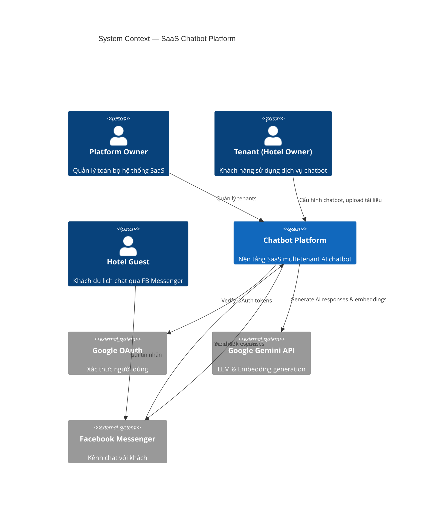
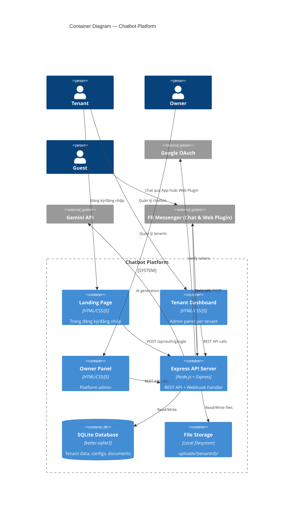
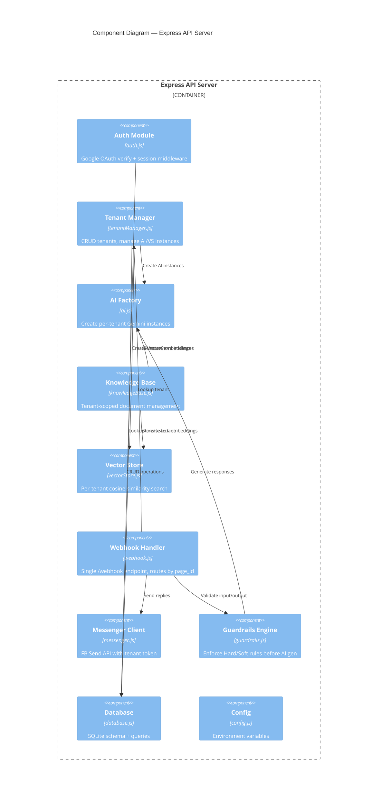
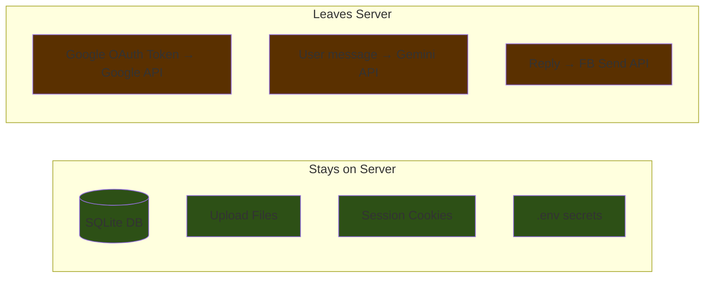
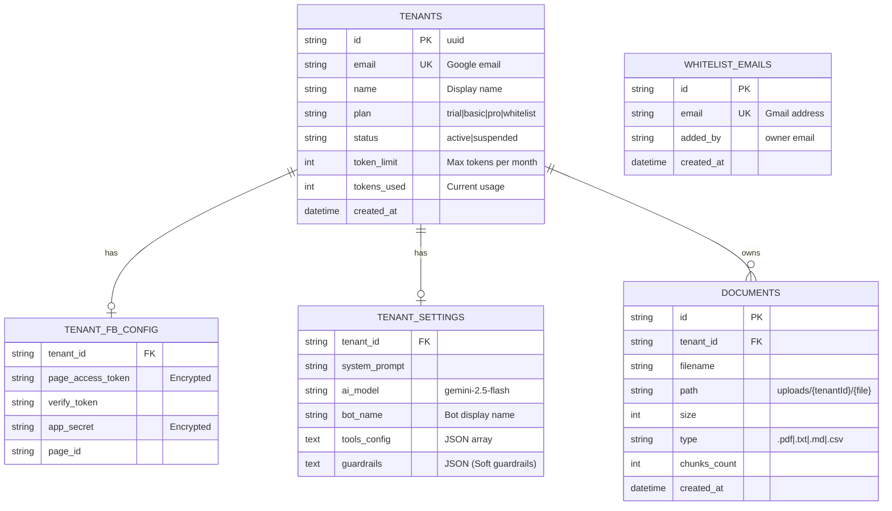

# Architecture — SaaS Chatbot Platform

## Level 1 — System Context



| Element | Type | Description |
|---------|------|-------------|
| Platform Owner | Person | `anhle.lha@gmail.com` — quản lý tất cả tenants |
| Tenant | Person | Hotel owner đăng ký tài khoản, cấu hình chatbot riêng |
| Hotel Guest | Person | Người dùng cuối chat trên FB Messenger |
| Chatbot Platform | System | Node.js Express app, multi-tenant |
| Google OAuth | External | Xác thực đăng nhập bằng Gmail |
| Google Gemini | External | AI generation + text embedding |
| Facebook Messenger | External | Kênh liên lạc với khách |

## Level 2 — Container Diagram



| Container | Technology | Role |
|-----------|-----------|------|
| Landing Page | Static HTML/CSS/JS | Giới thiệu sản phẩm, Google Sign-In |
| Tenant Dashboard | Static HTML/CSS/JS | 4 pages: Dashboard, Knowledge, Agent, Settings |
| Owner Panel | Static HTML/CSS/JS | Quản lý danh sách tenants |
| Express API | Node.js 18+ | REST API, webhook handler, auth, business logic |
| SQLite DB | better-sqlite3 | Persistent storage cho tenants, configs, documents |
| File Storage | Local disk | `uploads/{tenantId}/` — uploaded documents |

## Level 3 — Component Diagram (API Server)



> **Chi tiết thiết kế:** Mời xem tài liệu chi tiết cách hoạt động của Knowledge Base, RAG, Webhook Routing, và giới hạn Tenant tại [Component Design](./component-design.md).

## Facebook Integration Architecture

### Model: Single App, Multiple Pages

```mermaid
flowchart LR
    subgraph "Platform Owner"
        APP["1 Facebook App\ntrên Meta Developer"]
    end

    subgraph "Tenant A"
        PA[FB Page A]
    end

    subgraph "Tenant B"
        PB[FB Page B]
    end

    PA -->|Subscribe| APP
    PB -->|Subscribe| APP
    APP -->|All events| WH["/webhook"]
    WH -->|page_id=PA| AI_A[AI Instance A]
    WH -->|page_id=PB| AI_B[AI Instance B]
    WH -->|page_id=Platform| AI_PLAT[AI Solution Bot (Web Chat)]
```

### Webhook Routing Logic

1. FB gửi POST `/webhook` với `entry[].id` = `page_id`
2. Server query: `SELECT tenant_id FROM tenant_fb_config WHERE page_id = ?`
3. Load tenant AI instance + knowledge base
4. Generate response, send via tenant's `page_access_token`

### KH Setup Guide (hiển thị trong Dashboard Settings)

| Bước | Hành động |
|------|----------|
| 1 | Truy cập [Meta for Developers](https://developers.facebook.com) |
| 2 | Vào App (do Owner mời) -> Messenger Settings -> chọn FB Page -> Subscribe |
| 3 | Copy Page Access Token từ trang đó |
| 4 | Paste vào dashboard Settings |
| 5 | Hệ thống tự detect `page_id` qua `GET /me?access_token=TOKEN` |
| 6 | Done - Webhook tự động hoạt động |

> Webhook URL được Owner cấu hình 1 lần trên FB App. Tất cả Pages subscribe cùng App sẽ gửi events về cùng URL.

### Cách lấy Page Access Token

**MVP (Phase 1):** KH tự lấy token từ Graph API Explorer
1. Vào https://developers.facebook.com/tools/explorer/
2. Chọn App -> chọn Page -> quyền `pages_messaging`
3. Generate Access Token -> paste vào dashboard

**Production (Phase 2):** Facebook Login for Business
1. Dashboard có nút "Connect Facebook Page"
2. OAuth flow -> KH chọn Page -> cấp quyền -> hệ thống tự nhận token

### Auto-detect Page ID

Khi KH paste token, server gọi:
```
GET https://graph.facebook.com/v21.0/me?access_token=TOKEN
-> { "id": "PAGE_ID", "name": "Hotel Name" }
```
Tự lưu `page_id` + `page_name` vào `tenant_fb_config`.

## Security Analysis



| Risk | Level | Mitigation |
|------|-------|-----------|
| FB Page Token leak | High | Stored encrypted in DB, never sent to frontend |
| Tenant data isolation | High | All queries filtered by `tenant_id`, file paths namespaced |
| Session hijack | Medium | Signed cookies, httpOnly, secure in production |
| Gemini API key exposure | Medium | Single platform key in `.env`, not per-tenant |
| File upload malware | Low | File type whitelist, size limit 10MB |

## Data Model



> **Whitelist logic:** Khi user đăng nhập, nếu email nằm trong `whitelist_emails` → auto-set plan = `whitelist` (unlimited tokens, no payment).

## Deployment View

```
┌─────────────────────────────────────────────────┐
│  Local Machine (Development)                     │
│                                                  │
│  ┌──────────────┐    ┌──────────────────────┐   │
│  │ node server.js│    │  ngrok http 3000     │   │
│  │  Port: 3000   │◄───│  *.ngrok-free.app    │   │
│  └──────┬───────┘    └──────────────────────┘   │
│         │                                        │
│  ┌──────┴───────┐    ┌──────────────────────┐   │
│  │ data/app.db  │    │ uploads/{tenantId}/   │   │
│  │ (SQLite)     │    │ (documents)           │   │
│  └──────────────┘    └──────────────────────┘   │
└─────────────────────────────────────────────────┘
         │
         ▼ External APIs
┌────────┴─────────────────────────────┐
│ Google OAuth │ Gemini API │ FB Graph │
└──────────────────────────────────────┘
```

## ADR — Architecture Decision Records

### ADR-01: Database — SQLite vs PostgreSQL vs MongoDB

| Criteria | SQLite ✅ | PostgreSQL | MongoDB |
|----------|:---------:|:----------:|:-------:|
| Zero setup | ✅ | ❌ | ❌ |
| Single binary | ✅ | ❌ | ❌ |
| Suitable for MVP scale | ✅ | ✅ | ✅ |
| Relational queries | ✅ | ✅ | ⚠️ |
| Production scalability | ⚠️ | ✅ | ✅ |

**Why NOT PostgreSQL:** Requires separate server/service, overkill for MVP with <100 tenants.
**Why NOT MongoDB:** Schema-less adds complexity for structured tenant data.
**Decision:** ✅ SQLite — Zero config, single file, perfect for MVP. Migrate to PostgreSQL when scaling.

---

### ADR-02: Authentication — Google OAuth vs Email/Password vs Magic Link

| Criteria | Google OAuth ✅ | Email/Password | Magic Link |
|----------|:--------------:|:--------------:|:----------:|
| No password management | ✅ | ❌ | ✅ |
| User trust level | ✅ | ⚠️ | ✅ |
| Implementation complexity | ⚠️ | ❌ | ⚠️ |
| User explicitly requested | ✅ | ❌ | ❌ |

**Why NOT Email/Password:** User explicitly said "sử dụng gmail". Password storage adds security burden.
**Why NOT Magic Link:** Needs email service (SMTP), more infrastructure.
**Decision:** ✅ Google OAuth — Per user request, no password storage needed.

---

### ADR-03: Session Management — cookie-session vs express-session vs JWT

| Criteria | cookie-session ✅ | express-session | JWT |
|----------|:----------------:|:---------------:|:---:|
| No server-side store | ✅ | ❌ | ✅ |
| Simple implementation | ✅ | ⚠️ | ⚠️ |
| Works with SQLite | ✅ | ⚠️ | ✅ |
| Logout support | ✅ | ✅ | ❌ |

**Why NOT express-session:** Needs session store (Redis/DB), adds complexity.
**Why NOT JWT:** No easy invalidation/logout, token size grows.
**Decision:** ✅ cookie-session — Signed cookies, stateless, simple.

---

### ADR-04: Frontend — Static HTML vs React/Vite vs Next.js

| Criteria | Static HTML ✅ | Vite + React | Next.js |
|----------|:-------------:|:------------:|:-------:|
| Zero build step | ✅ | ❌ | ❌ |
| Matches existing codebase | ✅ | ❌ | ❌ |
| Mockup already in HTML | ✅ | ❌ | ❌ |
| Fast iteration | ✅ | ⚠️ | ⚠️ |

**Why NOT Vite/React:** Existing app is static HTML, mockup is static HTML. Adding build step is unnecessary overhead.
**Why NOT Next.js:** Server-side rendering not needed. Pure overhead for admin dashboard.
**Decision:** ✅ Static HTML/CSS/JS — Consistent with existing code and mockup.

---

### ADR-05: Multi-tenancy — Schema per tenant vs Row-level isolation vs Separate DBs

| Criteria | Row-level ✅ | Schema per tenant | Separate DBs |
|----------|:-----------:|:-----------------:|:------------:|
| Simple queries | ✅ | ⚠️ | ❌ |
| Single DB file | ✅ | ✅ | ❌ |
| Tenant isolation | ⚠️ | ✅ | ✅ |
| SQLite compatible | ✅ | ❌ | ⚠️ |

**Why NOT Schema per tenant:** SQLite doesn't support schemas.
**Why NOT Separate DBs:** File management complexity, connection pooling.
**Decision:** ✅ Row-level isolation — `tenant_id` column on all tables, enforced in every query.

---

### ADR-06: Webhook Routing — Single endpoint vs Per-tenant URL

| Criteria | Single /webhook + page_id ✅ | /webhook/:tenantId |
|----------|:---------------------------:|:------------------:|
| Standard FB SaaS pattern | ✅ | ❌ |
| No tenant ID in URL | ✅ | ❌ |
| Works with 1 FB App | ✅ | ⚠️ |
| KH setup simplicity | ✅ | ❌ |

**Why NOT /webhook/:tenantId:** Non-standard, exposes tenant ID, requires per-KH webhook config.
**Decision:** ✅ Single `/webhook` — Route by `page_id` from payload (ManyChat/Chatfuel pattern).

---

## Tech Stack Summary

| Layer | Technology |
|-------|-----------|
| Frontend | Vanilla HTML/CSS/JS (mockup design system) |
| Backend | Node.js 18+ / Express 4 |
| Database | SQLite (better-sqlite3) |
| Auth | Google OAuth 2.0 (google-auth-library) |
| Session | cookie-session (signed cookies) |
| AI | Google Gemini API (gemini-2.5-flash + embedding) |
| Channel | Facebook Messenger (Graph API v21.0) |
| Tunnel | ngrok (development) |
