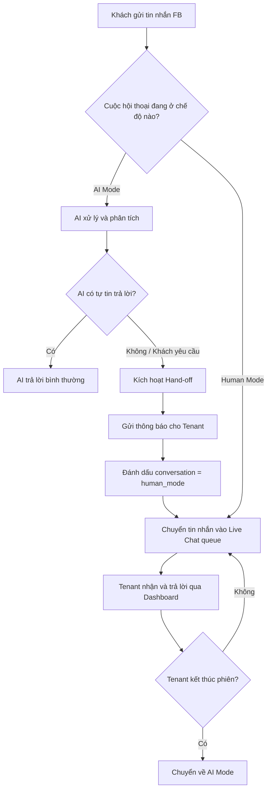

# F01: Live Chat Hand-off

> Khi AI không trả lời được hoặc khách yêu cầu, chuyển cuộc hội thoại sang nhân viên thật.

## 1. Vấn đề cần giải quyết

Hiện tại bot AI trả lời 100% tin nhắn. Khi:
- Khách hỏi quá phức tạp, ngoài phạm vi knowledge base
- Khách yêu cầu gặp nhân viên ("Cho tôi gặp quản lý", "Tôi muốn nói chuyện với người thật")
- AI nhận ra mình không biết câu trả lời

→ Bot vẫn cố trả lời → Trải nghiệm kém.

## 2. Giải pháp đề xuất

### 2.1 Luồng hoạt động



### 2.2 Cách phát hiện cần Hand-off

| Trigger | Cách hoạt động |
|---------|---------------|
| **Keyword detection** | Khách nói: "gặp nhân viên", "nói chuyện người thật", "quản lý", "hotline" |
| **AI self-assessment** | Thêm instruction vào system prompt: nếu không biết → trả lời `[HANDOFF]` |
| **Manual toggle** | Tenant bấm nút "Tiếp quản" trên Dashboard |

### 2.3 Cách thông báo cho Tenant (Notification)

> **Đây là câu hỏi của anh: "AI sẽ noti cho KS bằng cách nào?"**

| Phương án | Ưu điểm | Nhược điểm | Đề xuất |
|-----------|---------|------------|---------|
| **A. Dashboard Real-time (SSE/Polling)** | Không cần service ngoài, đơn giản | Tenant phải mở Dashboard | ✅ MVP |
| **B. Email notification** | Tenant nhận mọi lúc | Chậm (1-5 phút), dễ bỏ lỡ | Phase sau |
| **C. Telegram Bot** | Real-time, nhận mọi lúc | Cần thêm tích hợp Telegram | Phase sau |
| **D. SMS** | Chắc chắn nhận | Tốn phí, phức tạp | Không ưu tiên |

**Đề xuất MVP:** Dùng phương án **A (Dashboard Polling)** + **B (Email)** song song:
- Dashboard: badge đỏ + âm thanh khi có khách cần hỗ trợ
- Email: gửi 1 email khi có hand-off mới (dùng Nodemailer + Gmail SMTP, miễn phí)

## 3. Database Changes

### Bảng mới: `conversations`

```sql
CREATE TABLE conversations (
    id TEXT PRIMARY KEY,
    tenant_id TEXT NOT NULL,
    sender_id TEXT NOT NULL,        -- FB user PSID
    sender_name TEXT,
    mode TEXT DEFAULT 'ai',          -- 'ai' | 'human' | 'paused'
    last_message_at TEXT,
    handoff_reason TEXT,             -- Lý do chuyển sang human
    assigned_to TEXT,                -- Email nhân viên tiếp quản (nếu có)
    created_at TEXT DEFAULT (datetime('now')),
    FOREIGN KEY (tenant_id) REFERENCES tenants(id)
);
```

### Bảng mới: `messages`

```sql
CREATE TABLE messages (
    id INTEGER PRIMARY KEY AUTOINCREMENT,
    conversation_id TEXT NOT NULL,
    sender_type TEXT NOT NULL,       -- 'guest' | 'ai' | 'human'
    content TEXT NOT NULL,
    created_at TEXT DEFAULT (datetime('now')),
    FOREIGN KEY (conversation_id) REFERENCES conversations(id)
);
```

### Bảng mới: `notifications`

```sql
CREATE TABLE notifications (
    id INTEGER PRIMARY KEY AUTOINCREMENT,
    tenant_id TEXT NOT NULL,
    type TEXT NOT NULL,              -- 'handoff' | 'new_message' | 'system'
    title TEXT,
    body TEXT,
    is_read INTEGER DEFAULT 0,
    created_at TEXT DEFAULT (datetime('now')),
    FOREIGN KEY (tenant_id) REFERENCES tenants(id)
);
```

## 4. API Endpoints

| Method | Endpoint | Mô tả |
|--------|----------|-------|
| GET | `/api/conversations` | Danh sách cuộc hội thoại (tenant-scoped) |
| GET | `/api/conversations/:id/messages` | Lịch sử tin nhắn 1 cuộc hội thoại |
| POST | `/api/conversations/:id/reply` | Tenant gửi tin nhắn cho khách (human mode) |
| PUT | `/api/conversations/:id/mode` | Chuyển mode: ai ↔ human ↔ paused |
| GET | `/api/notifications` | Danh sách thông báo chưa đọc |
| PUT | `/api/notifications/:id/read` | Đánh dấu đã đọc |

## 5. Frontend Changes

### Dashboard — Tab "Live Chat" mới

- Danh sách cuộc hội thoại bên trái (giống Messenger)
- Khung chat bên phải để tenant gõ reply
- Badge đỏ trên sidebar khi có cuộc hội thoại ở `human` mode
- Nút "Chuyển về AI" để trả lại cho bot

### Dashboard — Notification bell

- Icon chuông ở header
- Badge số đỏ = số notification chưa đọc
- Click xổ dropdown danh sách thông báo

## 6. Webhook Changes

Sửa `webhook.js`:
- Trước khi gọi AI → check `conversation.mode`
- Nếu `mode === 'human'` → lưu message vào DB, tạo notification, KHÔNG gọi AI
- Nếu `mode === 'ai'` → flow hiện tại + lưu message vào DB

## 7. ADR

### ADR-07: Notification Channel cho Live Chat Hand-off

| Criteria | Dashboard Polling ✅ | WebSocket | Telegram Bot |
|----------|:-------------------:|:---------:|:------------:|
| Độ phức tạp | ✅ Thấp | ⚠️ Trung bình | ❌ Cao |
| Real-time | ⚠️ Gần real-time (5s) | ✅ Instant | ✅ Instant |
| Không cần service ngoài | ✅ | ✅ | ❌ |
| Nhận khi không mở Dashboard | ❌ | ❌ | ✅ |
| Phù hợp MVP | ✅ | ⚠️ | ❌ |

**Decision:** ✅ Dashboard Polling (5s interval) + Email notification — Đơn giản nhất cho MVP, không cần thêm dependency. Email bổ sung để tenant nhận khi không mở Dashboard.

### ADR-08: Lưu trữ tin nhắn

| Criteria | SQLite (conversations + messages) ✅ | Redis Stream | Không lưu |
|----------|:-----------------------------------:|:------------:|:---------:|
| Persistent | ✅ | ⚠️ Cần cấu hình | ❌ |
| Query history | ✅ SQL | ⚠️ Phức tạp | ❌ |
| Không thêm dependency | ✅ | ❌ (cần Redis) | ✅ |
| Scale | ⚠️ Đủ cho MVP | ✅ | N/A |

**Decision:** ✅ SQLite — Consistent với kiến trúc hiện tại, đủ cho MVP scale.

---

## 8. Phạm vi MVP

- [x] Detect hand-off (keyword + AI self-assessment)
- [x] Lưu conversation history
- [x] Dashboard Live Chat UI (danh sách + chat)
- [x] Tenant reply qua Dashboard
- [x] Notification badge
- [ ] Email notification (Phase 2.1)
- [ ] Telegram notification (Phase 3)
