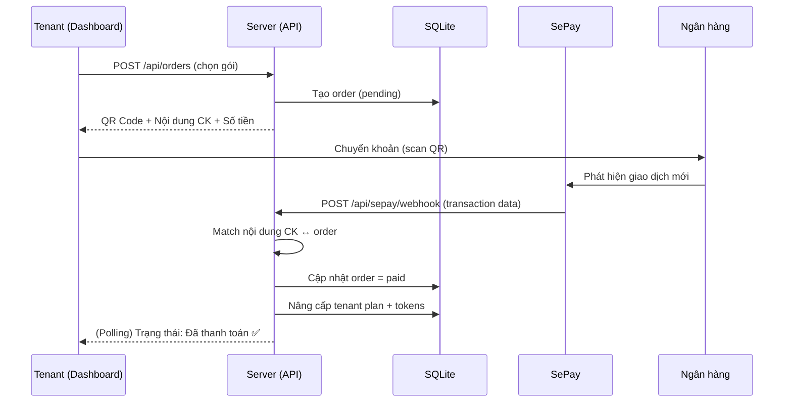
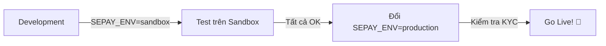

# F02: SePay Payment Integration

> Tích hợp thanh toán chuyển khoản ngân hàng tự động qua SePay để tenant nạp tokens/nâng cấp gói.

## 1. Vấn đề cần giải quyết

Hiện tại, hệ thống chỉ có 2 plan: `trial` (giới hạn) và `whitelist` (unlimited, Owner add thủ công). Cần cơ chế:
- Tenant **tự nâng cấp plan** bằng cách chuyển khoản ngân hàng
- Hệ thống **tự động xác nhận** thanh toán (không cần Owner duyệt thủ công)
- Hiển thị **lịch sử thanh toán** cho Tenant và Owner

## 2. SePay là gì?

SePay (sepay.vn) là cổng thanh toán Việt Nam, hoạt động theo mô hình:
1. Tenant chuyển khoản đến tài khoản ngân hàng của Owner (có nội dung mã đơn hàng)
2. SePay detect giao dịch mới → gọi **Webhook** đến server
3. Server match nội dung chuyển khoản → xác nhận đơn hàng tự động

**Ưu điểm:** Miễn phí 500 giao dịch/tháng, không cần khách có thẻ quốc tế, phù hợp thị trường Việt Nam.

## 3. Luồng thanh toán



## 4. Plans & Pricing

| Plan | Giá/tháng | Token limit | Tài liệu | Ghi chú |
|------|-----------|-------------|-----------|---------|
| Trial | Miễn phí | 5,000 | 3 files | Auto khi đăng ký |
| Basic | 200,000₫ | 50,000 | 10 files | Gói phổ biến |
| Pro | 500,000₫ | 200,000 | Unlimited | Dành cho KS lớn |
| Whitelist | Miễn phí | Unlimited | Unlimited | Owner add thủ công |

> **Lưu ý:** Giá trên là gợi ý, Owner có thể tuỳ chỉnh qua Admin Panel.

## 5. Database Changes

### Bảng mới: `orders`

```sql
CREATE TABLE orders (
    id TEXT PRIMARY KEY,              -- UUID, ví dụ: 'ORD-abc123'
    tenant_id TEXT NOT NULL,
    plan TEXT NOT NULL,                -- 'basic' | 'pro'
    amount INTEGER NOT NULL,           -- Số tiền (VND)
    transfer_content TEXT NOT NULL,    -- Nội dung CK unique, VD: 'AI4ALL ORD abc123'
    status TEXT DEFAULT 'pending',     -- 'pending' | 'paid' | 'expired' | 'cancelled'
    sepay_transaction_id TEXT,         -- ID giao dịch từ SePay
    paid_at TEXT,
    expires_at TEXT,                   -- Tự hết hạn sau 30 phút
    created_at TEXT DEFAULT (datetime('now')),
    FOREIGN KEY (tenant_id) REFERENCES tenants(id)
);
```

### Bảng mới: `payment_history`

```sql
CREATE TABLE payment_history (
    id INTEGER PRIMARY KEY AUTOINCREMENT,
    tenant_id TEXT NOT NULL,
    order_id TEXT NOT NULL,
    plan_from TEXT,                    -- Plan trước khi nâng cấp
    plan_to TEXT,                      -- Plan sau khi nâng cấp
    amount INTEGER,
    paid_at TEXT,
    FOREIGN KEY (tenant_id) REFERENCES tenants(id),
    FOREIGN KEY (order_id) REFERENCES orders(id)
);
```

## 6. API Endpoints

### Tenant APIs

| Method | Endpoint | Mô tả |
|--------|----------|-------|
| GET | `/api/plans` | Danh sách plans + giá |
| POST | `/api/orders` | Tạo đơn hàng mới (chọn plan) |
| GET | `/api/orders/:id` | Chi tiết đơn hàng (polling trạng thái) |
| GET | `/api/orders` | Lịch sử đơn hàng của tenant |

### SePay Webhook

| Method | Endpoint | Mô tả |
|--------|----------|-------|
| POST | `/api/sepay/webhook` | SePay gọi khi có giao dịch mới |

### Owner APIs

| Method | Endpoint | Mô tả |
|--------|----------|-------|
| GET | `/api/owner/orders` | Tất cả đơn hàng trên hệ thống |
| GET | `/api/owner/revenue` | Doanh thu theo tháng |

## 7. SePay Webhook Handler

```
POST /api/sepay/webhook

Headers:
  Authorization: Apikey {SEPAY_API_KEY}

Body (từ SePay):
{
  "id": 12345,
  "gateway": "MBBank",
  "transactionDate": "2026-02-26 15:00:00",
  "accountNumber": "0123456789",
  "transferType": "in",
  "transferAmount": 200000,
  "accumulated": 5000000,
  "code": null,
  "content": "AI4ALL ORD abc123",          ← Match với orders.transfer_content
  "referenceCode": "FT26057xxxxx",
  "description": "..."
}
```

**Logic xử lý:**
1. Verify `Authorization` header (so sánh API Key)
2. Parse `content` → tìm order có `transfer_content` match
3. Verify `transferAmount` = `order.amount`
4. Update `order.status = 'paid'`
5. Update `tenant.plan` và `tenant.token_limit`
6. Log vào `payment_history`
7. Response `200 OK`

## 8. Frontend Changes

### Dashboard — Tab "Nâng cấp" mới

- Bảng so sánh Plans (Trial / Basic / Pro)
- Nút "Nâng cấp" → hiện modal với:
  - QR Code chuyển khoản (generate từ VietQR)
  - Nội dung chuyển khoản (auto-copy)
  - Số tiền
  - Countdown 30 phút
  - Auto-polling trạng thái mỗi 5s
- Sau khi thanh toán thành công → animation confetti 🎉 + cập nhật plan

### Owner Panel — Tab "Doanh thu" mới

- Biểu đồ doanh thu theo tháng
- Danh sách giao dịch gần đây
- Tổng thu nhập

## 9. Security

| Rủi ro | Giải pháp |
|--------|-----------|
| Fake webhook call | Verify API Key trong Authorization header |
| Replay attack | Check order.status, chỉ xử lý `pending` orders |
| Sai số tiền | Verify transferAmount === order.amount |
| Order spam | Rate limit tạo order (max 5/giờ/tenant), expire sau 30 phút |
| Nội dung CK trùng | UUID trong transfer_content đảm bảo unique |

## 10. Dual Environment (Sandbox / Production)

> SePay hỗ trợ môi trường Sandbox để test trước khi lên Production.

### Cách hoạt động

| | Sandbox (Dev) | Production |
|--|---------------|------------|
| **Dashboard** | `my.dev.sepay.vn` | `my.sepay.vn` |
| **API Base URL** | `https://my.dev.sepay.vn/userapi` | `https://my.sepay.vn/userapi` |
| **Tiền thật** | ❌ Giả lập | ✅ Thật |
| **Webhook** | ✅ Hỗ trợ | ✅ Hỗ trợ |
| **KYC** | Auto-approve (~5 phút) | Cần xác minh |

### Logic trong code

```javascript
// src/config.js
const SEPAY_ENV = process.env.SEPAY_ENV || 'sandbox'; // 'sandbox' | 'production'

const SEPAY_BASE_URL = SEPAY_ENV === 'production'
    ? 'https://my.sepay.vn/userapi'
    : 'https://my.dev.sepay.vn/userapi';

// Tất cả API calls dùng SEPAY_BASE_URL
```

### Quy trình chuyển đổi



### Đăng ký Sandbox

1. Vào `my.dev.sepay.vn` → Đăng ký tài khoản mới
2. Liên hệ SePay để kích hoạt (qua Messenger hoặc Hotline)
3. Dùng tính năng "Giả lập giao dịch" để test Webhook
4. Sau khi test OK → Đổi `SEPAY_ENV=production` trong `.env`

## 11. Environment Variables (thêm mới)

```env
# SePay
SEPAY_ENV=sandbox                    # 'sandbox' | 'production'
SEPAY_API_KEY=your_sepay_api_key
SEPAY_BANK_ACCOUNT=0123456789
SEPAY_BANK_NAME=MBBank
SEPAY_ACCOUNT_NAME=NGUYEN VAN A

# Plan pricing (VND)
PLAN_BASIC_PRICE=200000
PLAN_PRO_PRICE=500000
PLAN_BASIC_TOKENS=50000
PLAN_PRO_TOKENS=200000
```

## 12. ADR

### ADR-09: Cổng thanh toán — SePay vs Stripe vs VNPay

| Criteria | SePay ✅ | Stripe | VNPay |
|----------|:-------:|:------:|:-----:|
| Thị trường VN | ✅ Tối ưu | ⚠️ Cần thẻ quốc tế | ✅ |
| Phí | ✅ Free 500 tx/tháng | ❌ 2.9% + $0.30 | ⚠️ ~1.1% |
| Setup phức tạp | ✅ Đơn giản (API Key) | ⚠️ Trung bình | ❌ Nhiều giấy tờ |
| Webhook real-time | ✅ | ✅ | ✅ |
| Chuyển khoản ngân hàng | ✅ Native | ❌ | ✅ |
| Phù hợp MVP | ✅ | ❌ | ⚠️ |

**Why NOT Stripe:** Yêu cầu thẻ quốc tế, phí cao, không phù hợp thị trường Việt Nam nhỏ.
**Why NOT VNPay:** Setup phức tạp, cần nhiều giấy tờ doanh nghiệp, phí theo %.
**Decision:** ✅ SePay — Miễn phí cho startup, native bank transfer, API đơn giản, phù hợp hoàn hảo cho MVP tại VN.

### ADR-10: QR Code thanh toán — VietQR vs Custom

| Criteria | VietQR (Napas) ✅ | Custom QR |
|----------|:----------------:|:---------:|
| Hỗ trợ mọi app ngân hàng | ✅ | ❌ |
| Tự điền nội dung CK | ✅ | ⚠️ |
| Không cần dependency | ✅ (URL-based) | ❌ |
| Chuẩn quốc gia | ✅ | ❌ |

**Decision:** ✅ VietQR — Dùng URL `https://img.vietqr.io/image/...` để generate QR code, không cần thư viện, user scan là tự điền đầy đủ thông tin.

---

## 13. Phạm vi MVP

- [x] Bảng plans + pricing
- [x] Tạo order + QR Code (VietQR)
- [x] SePay Webhook handler
- [x] Auto upgrade plan khi thanh toán thành công
- [x] Dashboard "Nâng cấp" tab
- [x] Order history cho tenant
- [ ] Owner revenue dashboard (Phase 2.1)
- [ ] Email xác nhận thanh toán (Phase 2.1)
- [ ] Auto-renew hàng tháng (Phase 3)
