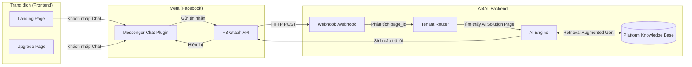
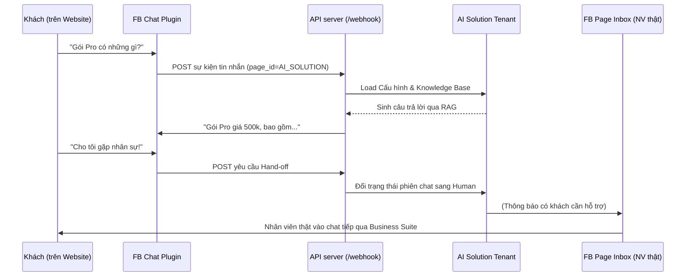

# F05: Platform Web Chat Integration

## 1. Tổng quan (Overview)
Tính năng Web Chat giúp khách truy cập `Landing Page` và `Upgrade Page` của nền tảng AI4All có thể chat trực tiếp với "Lễ tân ảo AI" của nền tảng. 
Bot sẽ giải thích các tính năng SaaS, ưu điểm, bảng giá, và giúp khách hàng ra quyết định nâng cấp.

## 2. Kiến trúc & Lựa chọn Công nghệ

Áp dụng phương án **Tích hợp Meta Messenger Chat Plugin (Option A)**.

### Lý giải Lựa chọn (Option A vs Option B)
Trong quá trình thiết kế, chúng tôi đã cân nhắc 2 phương án:
- **Option A (Facebook Messenger Chat Plugin):** Sử dụng plugin chat chính thức của Meta nhúng thẳng vào website. Khách hàng dùng tài khoản Facebook hoặc chat dưới dạng Guest. Tin nhắn đổ thẳng về Inbox của Fanpage (Meta Business Suite).
- **Option B (Tự phát triển Web Chat Widget):** Tự thiết kế và code một cửa sổ chat riêng trên website, yêu cầu tự xử lý WebSocket real-time, lập trình lưu trữ tin nhắn DB riêng, và xây dựng giao diện Inbox riêng cho nhân viên trực.

Quyết định chốt **Option A** vì nó mang lại nhiều giá trị vượt trội và phù hợp nhất với tiêu chí "nhanh, tiện, tiết kiệm" cho nền tảng hiện tại:
- **Tích hợp kênh Hand-off tự nhiên:** Khi bot không thể trả lời và chuyển sang chế độ Hand-off, tin nhắn sẽ nằm sẵn trong Inbox của Fanpage (Meta Business Suite). Admin/Sale của AI Solution chỉ cần dùng app Meta trên điện thoại để chat tiếp tục với khách ngay lập tức mà không cần chúng ta phải code thêm một hệ thống "Multi-channel Inbox" phức tạp và tốn kém Server WebSocket resources rườm rà.
- **Tiếp cận lại khách hàng dễ dàng:** Khách dùng Facebook để chat trên web, chúng ta có ngay thông tin Profile, giúp cho việc CSKH và retargeting về sau rất dễ dàng (so với việc tự code web widget mà khách chat ẩn danh).
- **Chi phí & Thời gian:** Zero chi phí server duy trì kết nối chat real-time, chỉ tốn < 1 giờ dev để nhúng script, cực kỳ tiết kiệm nguồn lực so với việc code từ đầu (Option B).

## 3. Hoạt động của Hệ thống

### 3.1. Data Flow Diagram

### 3.2. Chuỗi sự kiện (Sequence Diagram)

## 4. Implementation Steps

### 4.1. Nhúng Chat Plugin Snippet
- Bổ sung `<script>` chuẩn của Facebook (hoạt động đồng thời trên `landing.html`, `upgrade.html`).
- Thẻ `

`

### 4.2. Cấu hình Tenant Nền Tảng (Admin Tenant)
Hệ thống cần cung cấp cho Admin Owner một Tenant ẩn trong Database có:
- `tenant_id` là UUID nội bộ.
- `tenant_fb_config` trỏ đến `page_id` thật của AI Solution Team.
- `page_access_token` để Bot phản hồi.
- Bảng giới hạn: Unlimited Tokens.

### 4.3. Kiến trúc RAG (Knowledge Base) cho Platform
Để Bot nắm được nội dung tư vấn:
- Nội dung file upload: `PLATFORM_FAQ.md` định nghĩa:
  - Bảng Giá (Free, Basic, Pro).
  - Khác biệt tính năng.
  - Hướng dẫn cấu hình Stripe, FB Page Token.
  - Chính sách Refund, Server Uptime SLA.
- File này sẽ được upload vào DB `documents` thông qua account thư mục `uploads/[admin-tenant]/` để AI sinh Embedding vectors và phục vụ Chat.

## 5. User Journey
- **Guest 1 (Tìm hiểu):** Vào Landing Page → Nhấn chat: "Tính năng Hand-off là gì?" → Bot tra RAG giải thích: "Đây là tính năng chuyển cho nhân viên thật..."
- **Guest 2 (Giới hạn tài khoản nâng cấp):** Vào Upgrade Page → Nhạc nhiên: "Giá 500k cho Pro có giới hạn khách sạn không?" → Bot tra bảng giá: "Dạ không giới hạn khách sạn, nhưng bạn có 200,000 tokens/tháng."
- **Guest 3 (Kỹ thuật sâu/Cần người):** "Tích hợp DB riêng được không?" → Bot (do giới hạn Soft Guardrails) nói "Dạ để em kích hoạt Hand-off" → Sale/Admin của AI Solution nhận thông báo ở Facebook Page App điện thoại → Nhảy vào chốt hạ hợp đồng.
